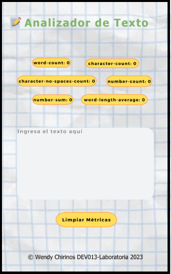

# 📝Analizador de texto
Esta es una aplicación para extraer información útil de un
texto utilizando diversas técnicas, como el procesamiento del lenguaje
natural (NLP), el aprendizaje automático (ML) y el análisis estadístico.
Estas aplicaciones pueden proporcionar una variedad de métricas que brindan
información básica sobre la longitud y la estructura del texto como por
ejemplo, el conteo de palabras, el conteo de caracteres, el conteo de
oraciones y el conteo de párrafos. Otras métricas incluyen el análisis
de sentimientos, que utiliza técnicas de NLP para determinar el tono
general positivo, negativo o neutral del texto, y el análisis de
legibilidad, que utiliza algoritmos para evaluar la complejidad y la
legibilidad del texto.

En general, las aplicaciones de análisis de texto brindan información
valiosa y métricas sobre los textos que pueden ayudar a las usuarias a
tomar decisiones informadas y sacar conclusiones significativas.
Mediante el uso de estas herramientas de análisis, las usuarias pueden
obtener una comprensión más profunda de los textos.

Esta aplicación se creó utilizando: HTML, CSS y JavaScript.

## 1. Prototipo

 
(https://wendy-alejandra.github.io/DEV013-text-analyzer/src/)

## 2. 🔨Funcionalidades

1. La aplicación permite a la usuaria ingresar un texto escribiéndolo
en un cuadro de texto.

2. calcula las siguientes métricas y actualiza el resultado en tiempo real a
medida que la usuaria escribe su texto:

    - **Recuento de palabras**: la aplicación cuenta el número de
    palabras en el texto de entrada y muestra este recuento a la usuaria.
    - **Recuento de caracteres**: la aplicación puede contar el número de
    caracteres en el texto de entrada, incluidos espacios y signos de
    puntuación, y muestra este recuento a la usuaria.
    - **Recuento de caracteres excluyendo espacios y signos de puntuación**:
    la aplicación cuenta el número de caracteres en el texto de     entrada,
    excluyendo espacios y signos de puntuación, y muestra este recuento
    a la usuaria.
    - **Recuento de números**: la aplicación cuenta la cantidad de números que hay en
    el texto de entrada y muestra este recuento a la usuaria.
    - **Suma total de números**: la aplicación suma todos los números que
    hay en el texto de entrada y muestra el resultado a la usuaria.
    - **Longitud media de las palabras**: la aplicación calcula la
    longitud media de las palabras en el texto de entrada y se la muestra a la usuaria.

3. La aplicación permite limpiar el contenido de la caja de texto haciendo
clic en un botón.

## 3. Criterios de aceptación mínimos del proyecto

A continuación encontrarás los criterios de aceptación mínimos del proyecto
relacionados con cada objetivo de aprendizaje.

### HTML

* **Uso de HTML semántico**

  - [x] La aplicación tiene un encabezado conformado por un
  [`<header>`](https://developer.mozilla.org/en-US/docs/Web/HTML/Element/header)
  que es padre de un
  [`<h1>`](https://developer.mozilla.org/en-US/docs/Web/HTML/Element/h1)
  con texto `Analizador de texto`. Para que puedas practicar más, estos
  elementos no pueden tener atributos `id`, ni `name`, ni `class`.

  - [x] La aplicación usa un
  [`<textarea>`](https://developer.mozilla.org/en-US/docs/Web/HTML/Element/textarea)
  con un el atributo `name` en el valor `user-input` para permitir a la usuaria
  ingresar un texto. Para que puedas practicar más, este elemento no puede
  tener atributos `id`, ni `class`.

  - [x] La aplicación usa un
  [`<ul>`](https://developer.mozilla.org/en-US/docs/Web/HTML/Element/ul)
  con 6 hijos [`<li>`](https://developer.mozilla.org/en-US/docs/Web/HTML/Element/li),
  uno para mostrar cada métrica.  Para que puedas practicar más, estos
  elementos no pueden tener atributos `id` ni `name` ni hijos.

  - [x] El [`<li>`](https://developer.mozilla.org/en-US/docs/Web/HTML/Element/li)
  para mostrar el _recuento de palabras_ debe tener un atributo
  `data-testid` con valor `word-count`.

  - [x] El [`<li>`](https://developer.mozilla.org/en-US/docs/Web/HTML/Element/li)
  para mostrar el _recuento de caracteres_ debe tener un atributo
  `data-testid` con valor `character-count`.

  - [x] El [`<li>`](https://developer.mozilla.org/en-US/docs/Web/HTML/Element/li)
  para mostrar el
  _recuento de caracteres excluyendo espacios y signos de puntuación_
  debe tener un atributo
  `data-testid` con valor `character-no-spaces-count`.

  - [x] El [`<li>`](https://developer.mozilla.org/en-US/docs/Web/HTML/Element/li)
  para mostrar el _recuento de números_ debe tener un atributo
  `data-testid` con valor `number-count`.

  - [x] El [`<li>`](https://developer.mozilla.org/en-US/docs/Web/HTML/Element/li)
  para mostrar la _suma total de números_ debe tener un atributo
  `data-testid` con valor `number-sum`.

  - [x] El [`<li>`](https://developer.mozilla.org/en-US/docs/Web/HTML/Element/li)
  para mostrar la _longitud media de palabras_ debe tener un atributo
  `data-testid` con valor `word-length-average`.

  - [x] La aplicación tiene un pie de página conformado por un
  [`<footer>`](https://developer.mozilla.org/en-US/docs/Web/HTML/Element/footer)
  que es padre de un
  [`
`](https://developer.mozilla.org/en-US/docs/Web/HTML/Element/p)
  que tiene como texto el nombre de la estudiante desarrolladora de la aplicación.
  Para que puedas practicar más, estos elementos no pueden
  tener atributos `id`, ni `name`, ni `class`.

  - [x] La aplicación usa un
  [`<button>`](https://developer.mozilla.org/en-US/docs/Web/HTML/Element/button)
  con el atributo `id` en el valor `reset-button` para permitir a la usuaria,
  mediante un clic, limpiar el contenido de la caja de texto.

### CSS

* **Uso de selectores de CSS**

  - [x] La aplicación usa
  [`selectores CSS de tipo`](https://developer.mozilla.org/en-US/docs/Learn/CSS/Building_blocks/Selectors/Type_Class_and_ID_Selectors#type_selectors)
  para darle estilo al
  [`<header>`](https://developer.mozilla.org/en-US/docs/Web/HTML/Element/header)
  y al
  [`<footer>`](https://developer.mozilla.org/en-US/docs/Web/HTML/Element/footer).

  - [x] La aplicación usa
  [`selectores CSS de class`](https://developer.mozilla.org/en-US/docs/Learn/CSS/Building_blocks/Selectors/Type_Class_and_ID_Selectors#class_selectors)
  para darle estilo a los
  [`<li>`](https://developer.mozilla.org/en-US/docs/Web/HTML/Element/li)
  descrito anteriormente.

  - [x] La aplicación usa
  [`selectores de atributo`](https://developer.mozilla.org/en-US/docs/Learn/CSS/Building_blocks/Selectors/Attribute_selectors)
  para darle estilo al
  [`<textarea>`](https://developer.mozilla.org/en-US/docs/Web/HTML/Element/textarea)
  usando el atributo `name`.

  - [x] La aplicación usa
  [`selectores CSS de ID`](https://developer.mozilla.org/en-US/docs/Learn/CSS/Building_blocks/Selectors/Type_Class_and_ID_Selectors#id_selectors)
  para darle estilo al
  [`<button>`](https://developer.mozilla.org/en-US/docs/Web/HTML/Element/button)
  con el atributo `id` en el valor `reset-button`.

* **Modelo de caja (box model): border, margen, padding**

  - [x] Las
  [`clases css`](https://developer.mozilla.org/en-US/docs/Learn/CSS/Building_blocks/Selectors/Type_Class_and_ID_Selectors#class_selectors)
  de los
  [`<li>`](https://developer.mozilla.org/en-US/docs/Web/HTML/Element/li)
  hijos del
  [`<ul>`](https://developer.mozilla.org/en-US/docs/Web/HTML/Element/ul)
  definen un estilo usando las propiedades del
  [modelo de caja](https://cssreference.io/box-model/),
  ([`background`](https://cssreference.io/backgrounds/),
  `border`,
  [`margin`](https://cssreference.io/property/margin/),
  [`padding`](https://cssreference.io/property/padding/)).

### Web APIs

* **Uso de selectores del DOM**

  - [x] La aplicación usa el
  [`selector del DOM querySelector`](https://developer.mozilla.org/en-US/docs/Web/API/Document/querySelector).

  - [x] La aplicación usa el
  [`selector del DOM getElementById`](https://developer.mozilla.org/en-US/docs/Web/API/Document/getElementById).

* **Manejo de eventos del DOM (listeners, propagación, delegación)**

  - [x] La aplicación registra un
  [Event Listener](https://developer.mozilla.org/en/docs/Web/API/EventTarget/addEventListener)
  para escuchar el evento `input` del `<textarea>` para actualizar las métricas
  cuando se haga escriba en el cuadro de texto.

  - [x] La aplicación registra un
  [Event Listener](https://developer.mozilla.org/en/docs/Web/API/EventTarget/addEventListener)
  para escuchar el evento `click` del `<button>` que limpia el contenido de la
  caja de texto.

* **Manipulación dinámica del DOM**
  - [x] La aplicación actualiza el atributo
  [`textContent`](https://developer.mozilla.org/es/docs/Web/API/Node/textContent)
  o
  [`innerHTML`](https://developer.mozilla.org/es/docs/Web/API/Element/innerHTML)
  de los `<li>` que mostrar las métricas del texto.

### JavaScript

* **Tipos de datos primitivos**

  - [x] La aplicación convierte valores tipo `string` a tipo `number`.

* **Strings (cadenas de caracteres)**

  - [x] La aplicación usa métodos para manipular strings como
  [`split`](https://developer.mozilla.org/en-US/docs/Web/JavaScript/Reference/Global_Objects/String/split),
  [`trim`](https://developer.mozilla.org/en-US/docs/Web/JavaScript/Reference/Global_Objects/String/trim)
  o
  [`replace`](https://developer.mozilla.org/en-US/docs/Web/JavaScript/Reference/Global_Objects/String/replace).

* **Variables (declaración, asignación, ámbito)**

  - [x] La aplicación declara variables con
  [`let`](https://developer.mozilla.org/en-US/docs/Web/JavaScript/Reference/Statements/let)
  y
  [`const`](https://developer.mozilla.org/en-US/docs/Web/JavaScript/Reference/Statements/const).

  - [x] La aplicación NO declara variables con  `var`.

* **Uso de condicionales (if-else, switch, operador ternario, lógica booleana)**

  - [x] La aplicación usa el statement
  [`if..else`](https://developer.mozilla.org/en-US/docs/Web/JavaScript/Reference/Statements/if...else)
  para evaluar condiciones.

* **Uso de bucles/ciclos (while, for, for..of)**

  - [x] La aplicación usa el statement
  [`for`](https://developer.mozilla.org/en-US/docs/Web/JavaScript/Reference/Statements/for)
  para crear un bucle.

* **Funciones (params, args, return)**

  - [x] El objeto `analyzer` contiene un método `getWordCount` para calcular el
  recuento de palabras de un texto.

  - [x] El objeto `analyzer` contiene un método `getCharacterCount` para calcular
  el recuento de caracteres de un texto.

  - [x] El objeto `analyzer` contiene un método `getCharacterCountExcludingSpaces`
  para calcular el recuento de caracteres excluyendo espacios y signos de
  puntuación de un texto.

  - [x] El objeto `analyzer` contiene un método `getNumbersCount` para contar
  cúantos números hay en un texto.

  - [x] El objeto `analyzer` contiene un método `getNumbersSum` para la suma
  longitud media de los números en un texto.

  - [x] El objeto `analyzer` contiene un método `getAverageWordLength` para
  calcular la longitud media de las palabras en un texto.

* **Pruebas unitarias (unit tests)**

  - [x] Se pasan todas las pruebas unitarias.

* **Módulos de ECMAScript (ES Modules)**

  - [x] La aplicación usan
  [`import`](https://developer.mozilla.org/en-US/docs/Web/JavaScript/Reference/Statements/import)
  y
  [`export`](https://developer.mozilla.org/en-US/docs/Web/JavaScript/Reference/Statements/export)
  para importar y exportar valores desde un modulo JavaScript.

* **Uso de linter (ESLINT)**

  - [x] Al ejecutar el linter no se muestran errores de formato y estilo.

* **Uso de identificadores descriptivos (Nomenclatura y Semántica)**

  - [x] En el código se utilizan identificadores descriptivos para variables
  y funciones.

### Control de Versiones (Git y GitHub)

* **GitHub: Creación de cuenta y repos, configuración de llaves SSH**

  - [x] La estudiante creó una cuenta en Github.

  - [x] La estudiante configuró su cuenta de Github con una llave SSH.

* **Git: Control de versiones con git (clone, add, commit, push)**

  - [x] La estudiante creó un _fork_ para su proyecto.

  - [x] La estudiante clonó su repositorio usando una llave SSH.

  - [x] La estudiante creó _commits_ y los guardó en Github.

* **GitHub: Despliegue con GitHub Pages**

  - [x] La aplicación está desplegada en Github Pages.

### Centrado en la usuaria

* **Diseñar y desarrollar un producto o servicio poniendo a las
usuarias en el centro**

### Diseño de producto

* **Diseñar en distintos niveles de fidelidad**

  - [x] La estudiante creó prototipos de baja fidelidad para la UI (interfaz gŕafica).

* **Seguir los principios básicos de diseño visual**

  - [x] Se tuvieron en cuenta las reglas básica del
  [diseño visual](https://coda.io/d/Bootcamp-UX-Contenido_dqkqk2rV9Z2/Reglas-basicas-de-diseno-visual_suVcO)
  para diseñar la UI (interfáz gráfica)

## 4. Consideraciones para pedir tu Project Feedback

Antes de agendar tu Project Feedback con un coach, asegúrate que tu proyecto:

* [x] Cumple con todos los criterios mínimos de aceptación al ejecutar `npm run test:oas`
* [x] Cumple con todas las pruebas unitarias al ejecutar `npm run test`
* [x] Cumple con todas las pruebas _end to end_ al ejecutar `npm run test:e2e`
* [x] Esta libre de _errores_ de `eslint` al ejecutar `npm run test`
* [x] Está subido a GitHub.
* [x] Esta desplegado en GitHub Pages.
* [x] Tiene un README con la definición del producto.

Recuerda que debes hacer una autoevaluación de _objetivos de aprendizaje_ y
_life skills_ desde tu dashboard de estudiante.

Si no has completado todo lo anterior, no consideramos que estás lista para
tu sesión de Project Feedback.

## 5. Objetivos de aprendizaje

Reflexiona y luego marca los objetivos que has llegado a entender y aplicar en tu proyecto. Piensa en eso al decidir tu estrategia de trabajo.

### HTML

- [x] **Uso de HTML semántico**

  

Links

  * [HTML semántico](https://curriculum.laboratoria.la/es/topics/html/html5/semantic-html)
  * [Semantics - MDN Web Docs Glossary](https://developer.mozilla.org/en-US/docs/Glossary/Semantics#Semantics_in_HTML)

### CSS

- [x] **Uso de selectores de CSS**

  

Links

  * [Intro a CSS](https://curriculum.laboratoria.la/es/topics/css/css/intro-css)
  * [CSS Selectors - MDN](https://developer.mozilla.org/es/docs/Web/CSS/CSS_Selectors)

- [x] **Modelo de caja (box model): borde, margen, padding**

  

Links

  * [Box Model & Display](https://curriculum.laboratoria.la/es/topics/css/css/boxmodel-and-display)
  * [The box model - MDN](https://developer.mozilla.org/en-US/docs/Learn/CSS/Building_blocks/The_box_model)
  * [Introduction to the CSS box model - MDN](https://developer.mozilla.org/en-US/docs/Web/CSS/CSS_Box_Model/Introduction_to_the_CSS_box_model)
  * [CSS display - MDN](https://developer.mozilla.org/pt-BR/docs/Web/CSS/display)
  * [display - CSS Tricks](https://css-tricks.com/almanac/properties/d/display/)

### Web APIs

- [x] **Uso de selectores del DOM**

  

Links

  * [Manipulación del DOM](https://curriculum.laboratoria.la/es/topics/browser/dom/1-dom-methods-selection)
  * [Introducción al DOM - MDN](https://developer.mozilla.org/es/docs/Web/API/Document_Object_Model/Introduction)
  * [Localizando elementos DOM usando selectores - MDN](https://developer.mozilla.org/es/docs/Web/API/Document_object_model/Locating_DOM_elements_using_selectors)

- [x] **Manejo de eventos del DOM (listeners, propagación, delegación)**

  

Links

  * [Introducción a eventos - MDN](https://developer.mozilla.org/es/docs/Learn/JavaScript/Building_blocks/Events)
  * [EventTarget.addEventListener() - MDN](https://developer.mozilla.org/es/docs/Web/API/EventTarget/addEventListener)
  * [EventTarget.removeEventListener() - MDN](https://developer.mozilla.org/es/docs/Web/API/EventTarget/removeEventListener)
  * [El objeto Event](https://developer.mozilla.org/es/docs/Web/API/Event)

- [x] **Manipulación dinámica del DOM**

  

Links

  * [Introducción al DOM](https://developer.mozilla.org/es/docs/Web/API/Document_Object_Model/Introduction)
  * [Node.appendChild() - MDN](https://developer.mozilla.org/es/docs/Web/API/Node/appendChild)
  * [Document.createElement() - MDN](https://developer.mozilla.org/es/docs/Web/API/Document/createElement)
  * [Document.createTextNode()](https://developer.mozilla.org/es/docs/Web/API/Document/createTextNode)
  * [Element.innerHTML - MDN](https://developer.mozilla.org/es/docs/Web/API/Element/innerHTML)
  * [Node.textContent - MDN](https://developer.mozilla.org/es/docs/Web/API/Node/textContent)

### JavaScript

- [x] **Tipos de datos primitivos**

  

Links

  * [Valores primitivos - MDN](https://developer.mozilla.org/es/docs/Web/JavaScript/Data_structures#valores_primitivos)

- [x] **Strings (cadenas de caracteres)**

  

Links

  * [Strings](https://curriculum.laboratoria.la/es/topics/javascript/strings)
  * [String — Cadena de caracteres - MDN](https://developer.mozilla.org/es/docs/Web/JavaScript/Reference/Global_Objects/String)

- [x] **Variables (declaración, asignación, ámbito)**

  

Links

  * [Valores, tipos de datos y operadores](https://curriculum.laboratoria.la/es/topics/javascript/basics/values-variables-and-types)
  * [Variables](https://curriculum.laboratoria.la/es/topics/javascript/basics/variables)

- [x] **Uso de condicionales (if-else, switch, operador ternario, lógica booleana)**

  

Links

  * [Estructuras condicionales y repetitivas](https://curriculum.laboratoria.la/es/topics/javascript/flow-control/conditionals-and-loops)
  * [Tomando decisiones en tu código — condicionales - MDN](https://developer.mozilla.org/es/docs/Learn/JavaScript/Building_blocks/conditionals)

- [x] **Uso de bucles/ciclos (while, for, for..of)**

  

Links

  * [Bucles (Loops)](https://curriculum.laboratoria.la/es/topics/javascript/flow-control/loops)
  * [Bucles e iteración - MDN](https://developer.mozilla.org/es/docs/Web/JavaScript/Guide/Loops_and_iteration)

- [x] **Funciones (params, args, return)**

  

Links

  * [Funciones (control de flujo)](https://curriculum.laboratoria.la/es/topics/javascript/flow-control/functions)
  * [Funciones clásicas](https://curriculum.laboratoria.la/es/topics/javascript/functions/classic)
  * [Arrow Functions](https://curriculum.laboratoria.la/es/topics/javascript/functions/arrow)
  * [Funciones — bloques de código reutilizables - MDN](https://developer.mozilla.org/es/docs/Learn/JavaScript/Building_blocks/Functions)

- [x] **Pruebas unitarias (unit tests)**

  

Links

  * [Empezando con Jest - Documentación oficial](https://jestjs.io/docs/es-ES/getting-started)

- [x] **Módulos de ECMAScript (ES Modules)**

  

Links

  * [import - MDN](https://developer.mozilla.org/es/docs/Web/JavaScript/Reference/Statements/import)
  * [export - MDN](https://developer.mozilla.org/es/docs/Web/JavaScript/Reference/Statements/export)

- [x] **Uso de linter (ESLINT)**

- [x] **Uso de identificadores descriptivos (Nomenclatura y Semántica)**

### Control de Versiones (Git y GitHub)

- [x] **Git: Instalación y configuración**

- [x] **Git: Control de versiones con git (init, clone, add, commit, status, push, pull, remote)**

- [x] **GitHub: Creación de cuenta y repos, configuración de llaves SSH**

- [x] **GitHub: Despliegue con GitHub Pages**

  

Links

  * [Sitio oficial de GitHub Pages](https://pages.github.com/)

### Centrado en el usuario

- [x] **Diseñar y desarrollar un producto o servicio poniendo a las usuarias en el centro**

### Diseño de producto

- [x] **Diseñar en distintos niveles de fidelidad**

- [x] **Seguir los principios básicos de diseño visual**

